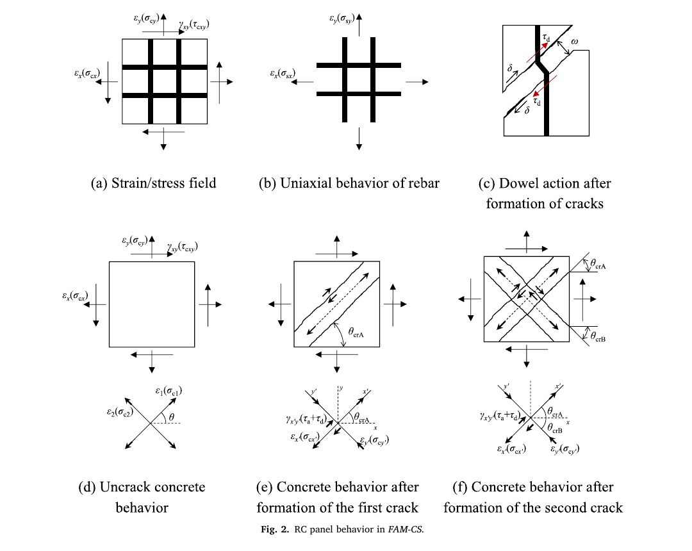
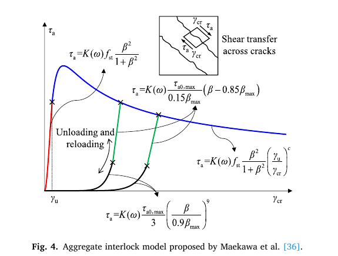

.. _FAM_CS:

FAM_CS Material
^^^^^^^^^^^^^^^

Code Developed by: **Shaohui Zhang**, **Xiaodong Ji**, and **Yue Yu** at Tsinghua University.

The FAM_CS material is a two-dimensional plane-stress nDMaterial for reinforced concrete panels and walls. FAM_CS stands for Fixed Angle Model Considering Crack Sliding. The material is intended for nonlinear simulation of reinforced concrete shear walls under tension/compression-flexure-shear and flexure-shear loading, including walls subjected to coupled axial tension and cyclic lateral loads [Zhang2024FAMCS]_.

The model keeps crack directions fixed after cracking and represents the reinforced concrete panel response using horizontal and vertical rebar materials together with concrete struts. Nonlinear shear aggregate interlock along concrete cracks [Maekawa2003FAMCS]_ and rebar dowel action are included to represent shear transfer mechanisms along crack surfaces. When two crack systems are active, the model activates the crack with lower shear stiffness for the aggregate interlock and dowel action calculation.

The panel-level mechanisms represented by FAM_CS are illustrated below. The material response combines the in-plane panel stress and strain field, uniaxial rebar response, dowel action after cracking, and concrete behavior before and after crack formation.

The shear transfer mechanism along crack surfaces includes nonlinear aggregate interlock, as shown below.

.. admonition:: Command

   nDMaterial FAM_CS $matTag $rho $sX $sY $conc $rouX $rouY $dY $Gamax $lm0 $sh

.. csv-table::
   :header: "Parameter", "Type", "Description"
   :widths: 12, 10, 45

   $matTag, integer, unique nDMaterial tag
   $rho, float, material density
   $sX, integer, tag of the uniaxialMaterial for horizontal x-direction reinforcement
   $sY, integer, tag of the uniaxialMaterial for vertical y-direction reinforcement
   $conc, integer, tag of the uniaxialMaterial for concrete
   $rouX, float, reinforcement ratio in the horizontal x direction
   $rouY, float, reinforcement ratio in the vertical y direction
   $dY, float, diameter of vertical reinforcement
   $Gamax, float, maximum size of coarse aggregate
   $lm0, float, calculated average crack spacing
   $sh, float, spacing of horizontal reinforcement

.. note::

   The FAM_CS implementation uses response quantities supplied by the concrete uniaxial material. The current example uses ``ConcreteCM`` for the concrete material and ``SteelMPF`` for the reinforcing steel materials.

   The model is intended for plane-stress reinforced concrete wall and panel simulations, for example with 2D continuum elements.

The following recorders are available with the FAM_CS material.

.. csv-table::
   :header: "Recorder", "Description"
   :widths: 24, 45

   panel_strain, "panel strains :math:`\epsilon_x`, :math:`\epsilon_y`, and :math:`\gamma_{xy}`"
   panel_stress, "panel stresses :math:`\sigma_x`, :math:`\sigma_y`, and :math:`\tau_{xy}`"
   panel_stress_concrete, "concrete contribution to panel stresses"
   panel_stress_steel, "reinforcement contribution to panel stresses"
   strain_stress_steelX, "strain and stress of horizontal x-direction reinforcement"
   strain_stress_steelY, "strain and stress of vertical y-direction reinforcement"
   strain_stress_concrete1, "strain and stress of concrete strut 1"
   strain_stress_concrete2, "strain and stress of concrete strut 2"
   strain_stress_interlock1, "strain and stress from crack sliding mechanism 1"
   strain_stress_interlock2, "strain and stress from crack sliding mechanism 2"
   cracking_angles, "cracking angles for the crack systems"

.. admonition:: Verification

   The FAM_CS model was first validated using six reinforced concrete wall tests under coupled axial tension and cyclic lateral loads. The comparisons below show the experimentally measured and simulated load-deformation responses for the six specimens modeled with ``nDMaterial FAM_CS`` and ``quad`` elements.

   .. figure:: FAM_CS_validation_six_walls.png
      :align: center
      :width: 95%
      :figclass: align-center

   Additional validation examples include 75 reinforced concrete wall tests under compression-flexure-shear and flexure-shear loading conditions.

.. admonition:: Examples

   The following commands define one concrete material, two reinforcing steel materials, and one FAM_CS material.

   .. code-block:: tcl

      uniaxialMaterial ConcreteCM  2  -54.579  -0.005027  21714.2439  12  1.0134  2.1434  8e-05  1.2  10000
      uniaxialMaterial SteelMPF  101  349  349  206000  0.005  0.005  20  0.925  0.15
      uniaxialMaterial SteelMPF  103  397  397  206000  0.01  0.01  20  0.925  0.15

      nDMaterial FAM_CS  201  0  103  101  2  0.0093084  0.056316  22  16  74.0814  100

      recorder Element -file c_strain.out -time -eleRange 1 10 material 1 panel_strain

   A Tcl validation example for reinforced concrete wall specimen SW1 [Ji2018FAMCS]_ is provided below. Download all files before running ``main.tcl`` from the example directory.

   | :download:`main.tcl <FAM_CSExample/main.tcl>`
   | :download:`setPar.tcl <FAM_CSExample/setPar.tcl>`
   | :download:`analyze.tcl <FAM_CSExample/analyze.tcl>`
   | :download:`SW1Model.tcl <FAM_CSExample/SW1Model.tcl>`
   | :download:`SW1/loaddisp.txt <FAM_CSExample/SW1/loaddisp.txt>`
   | :download:`hestCurve_exp/SW1.txt <FAM_CSExample/hestCurve_exp/SW1.txt>`

   The FAM_CS material definitions in the SW1 model are:

   .. literalinclude:: FAM_CSExample/SW1Model.tcl
      :language: tcl
      :lines: 98-108

**References**

.. [Zhang2024FAMCS] Zhang, S., Ji, X., Sun, L., Yu, Y., and Cheng, X. (2024). "New OpenSees material model for simulating reinforced concrete shear walls subjected to coupled axial tension and cyclic lateral loads." Engineering Structures, 318, 118774. https://doi.org/10.1016/j.engstruct.2024.118774.

.. [Ji2018FAMCS] Ji, X., Cheng, X., and Xu, M. (2018). "Coupled axial tension-shear behavior of reinforced concrete walls." Engineering Structures, 167, 132-142. https://doi.org/10.1016/j.engstruct.2018.04.015.

.. [Maekawa2003FAMCS] Maekawa, K., Pimanmas, A., and Okamura, H. (2003). Non-linear mechanics of reinforced concrete. Spon Press.
